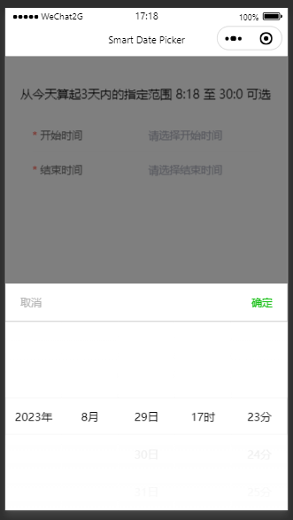
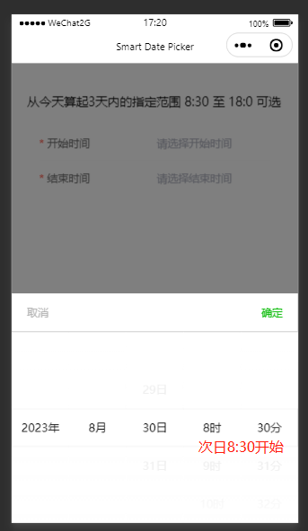
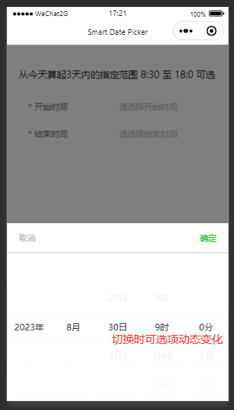

# smart-datepicker

一款基于 Taro 3.5 + NutUI 3.x 的日期选择器。

## 平台

微信小程序

## 特点

支持指定时间范围、自带逻辑交互。

在指定的日期时间范围内，才能操作。同时希望能在切换日期时，动态变更可选的时、分。

## 说明

本项目基于 Taro 3.5 搭建，使用 pnpm 包管理器安装依赖会报错。所以改用 yarn 。

## 截图

- 默认从符合指定范围内的时间开始选择

- 次日从指定范围开始

- 切换 hour 时 minute 可选项动态变化

## 最后

有任何疑问 issue 留言或者加微信号： KwanNgaiTung 。
